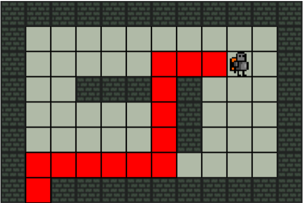

# RobotProb 
A simple representation of finding a path to exit with [pathfinding](https://www.npmjs.com/package/pathfinding) npm lib

## [cubbic.github.io/RobotProb](https://cubbic.github.io/RobotProb/)
## Installation
 * `git clone https://github.com/cubbic/RobotProb.git`
 * `cd RobotProb`
 * `npm install`
 * `watchify js/main.js -o js/bundle.js`

## Dependencies
* [browserify](http://browserify.org)
* [pathfinding](https://www.npmjs.com/package/pathfinding)

